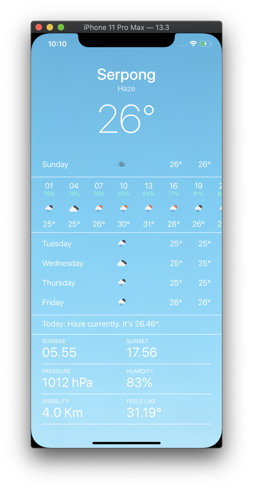

# iOS WeatherApp with SwiftUI

<div style="width: 1000px; height 600px;"></div>


## Overview

`iOS WeatherApp` is copy design from `Apple Weather App` uses [Openweathermap API](https://openweathermap.org/api) and build with SwiftUI. Feature this app same with apple weather like get current weather & details, get hourly forecast weather and get daily forecast. But detail not fully same because limited feature free plan from Openweathermap API.

### Keyword
- SwiftUI
- JSON & Codable
- MVVM
- ObservableObject

## Getting Started

### Prerequisites

- A valid API key from Openweathermap
- A Mac running macOS Catalina
- Xcode 11.3.1

### Installation

1. Clone or download the project to your local machine
2. Open the project in Xcode
3. Replace `YOURAPIKEY` with your valid Openweathermap API key in `OpenweathermapAPIClient.swift`

```swift
class OpenweathermapClient {

    ```
    private let apiKey = "YOURAPIKEY"
```

4. Replace `cityId` with your city want to use in `WeatherViewModel.swift` you can download list city json in [here](http://bulk.openweathermap.org/sample/)

```swift
class WeatherViewModel: ObservableObject {

    ```
    private let cityId = "1627459"
```

5. Run the simulator

## Thanks to

Apple amazing library [SwiftUI](https://developer.apple.com/xcode/swiftui/)

Open API from [OpenWeatherMap](https://openweathermap.org/api)

Inspiring project from [Weather-SwiftUI](https://github.com/bobbyconti/Weather-SwiftUI)
